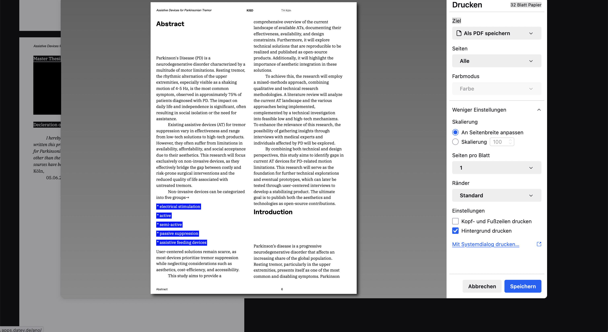

# React Paged

## Technologies Used

**React, Vite, TypeScript, Paged.js, Tailwind CSS**

This is a barebones starter template for using **Paged.js** with **React**. It includes **Tailwind CSS** and **TypeScript**, making it easy to build a custom component architecture for complex, print-ready documents.

For a fully styled version with a collection of ready-made components, see below:

### Stylized Version

[View on GitHub](https://github.com/mschmalenbach/react-paged)

### Live Demo

[Live Demo](https://proposal-i.vercel.app/)

---

## Architecture Overview

- **`App.tsx`** – Entry point that imports both `Book.tsx` and `Layouter.tsx`
- **`Book.tsx`** – Contains your document structure: components, chapters, and text
- **`Layouter.tsx`** – Renders the `Book.tsx` and applies `print.css` for paged styling
- **`print.css`** – Contains styles specific to Paged.js (warnings may appear, but can be ignored)
- **`index.css`** – Use this file for theme variables, fonts, and general styling

---

## Printing

To print your document, use the **browser’s print dialog** (`Cmd + P` / `Ctrl + P`).  
Paged.js supports additional features like **bleed margins** and **cutting guides**.

